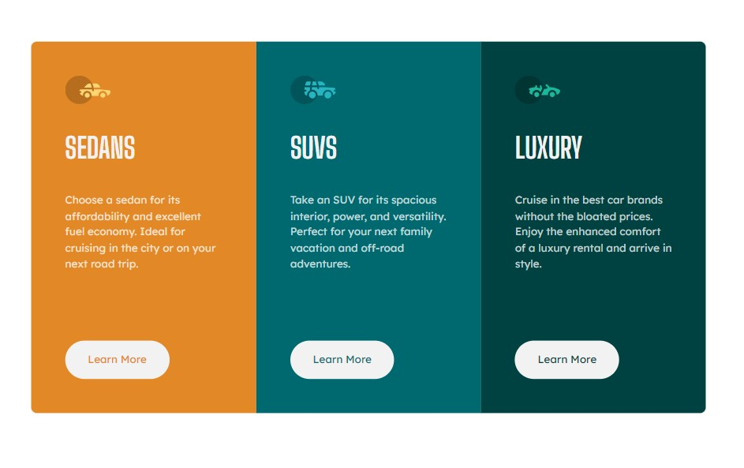

# Frontend Mentor - 3-column preview card component solution

This is a solution to the [3-column preview card component challenge on Frontend Mentor](https://www.frontendmentor.io/challenges/3column-preview-card-component-pH92eAR2-). Frontend Mentor challenges help you improve your coding skills by building realistic projects.

## Table of contents

- [Overview](#overview)
  - [The challenge](#the-challenge)
  - [Screenshot](#screenshot)
  - [Links](#links)
- [My process](#my-process)
  - [Built with](#built-with)
  - [What I learned](#what-i-learned)
- [Author](#author)

**Note: Delete this note and update the table of contents based on what sections you keep.**

## Overview

### The challenge

Users should be able to:

- View the optimal layout depending on their device's screen size
- See hover states for interactive elements

### Screenshot



### Links

- Solution URL: [Github](https://github.com/VimDiesel123/3-column-preview-card-component-main)
- Live Site URL: [Netlify](https://startling-gumption-e70c59.netlify.app/)

## My process

### Built with

- Semantic HTML5 markup
- CSS custom properties
- Flexbox
- CSS Grid
- Mobile-first workflow

### What I learned

This was an easy challenge for me, which is a good sign because when I started I sucked!

I used CSS grid for the main card layout and changed the layout to be resonsive like this:

```css
.card {
  grid-auto-flow: column;
  max-width: 66%;
}
```

I'm pretty happy with that solution! I think it was clean and easy.

## Author

- Website - [David Smith](https://www.dsmithdev.com)
- Frontend Mentor - [@VimDiesel123](https://www.frontendmentor.io/profile/VimDiesel123)